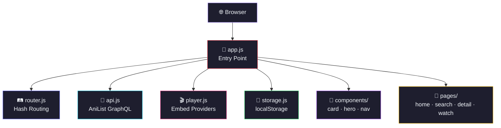

> [!NOTE]
> **AniBili** is a free, ad-free anime streaming app that runs entirely in your browser. No accounts, no ads, no setup. Just browse and watch.

<div align="center">
  
  

</div>

<p align="center">
  <a href="https://github.com/Shineii86/AniBili/stargazers"></a>
  <a href="https://github.com/Shineii86/AniBili/network/members"></a>
  <a href="https://github.com/Shineii86/AniBili/issues"></a>
  <a href="https://github.com/Shineii86/AniBili/pulls"></a>
  <a href="https://github.com/Shineii86/AniBili/commits"></a>
  <a href="https://github.com/Shineii86/AniBili/blob/main/LICENSE"></a>
</p>

<p align="center">
  
  
  
  
  
  
  
  
</p>

<p align="center">
  <b>A free, ad-free anime streaming app that runs entirely in your browser.</b><br/>
  Browse anime from AniList, stream instantly via embed players, track your watchlist and history.<br/>
  Pure vanilla JS, zero build steps, zero dependencies, no accounts needed.
</p>

<p align="center">
  <a href="#-table-of-contents">Table of Contents</a> &bull;
  <a href="#-features">Features</a> &bull;
  <a href="#-tech-stack">Tech Stack</a> &bull;
  <a href="#-quick-start">Quick Start</a> &bull;
  <a href="#-deployment">Deployment</a> &bull;
  <a href="#-contributing">Contributing</a>
</p>

---

> [!WARNING]
> 1. This `app` does not host any anime content — it only embeds players from 3rd party services.
> 2. This `app` is explicitly made for **educational purposes only** and not for commercial usage. This repo will not be responsible for any misuse of it.
> 3. All anime data, images, and content belong to their respective owners (AniList, Megavid, AniXo). This project is not affiliated with any streaming service.

---

## 📖 Table of Contents

- [Overview](#-overview)
- [Features](#-features)
- [Data Sources](#-data-sources)
- [Tech Stack](#-tech-stack)
- [Architecture](#-architecture)
- [Project Structure](#-project-structure)
- [Quick Start](#-quick-start)
- [Deployment](#-deployment)
- [Available Scripts](#-available-scripts)
- [Performance](#-performance)
- [Changelog Highlights](#-changelog-highlights)
- [Troubleshooting](#-troubleshooting)
- [FAQ](#-faq)
- [Roadmap](#-roadmap)
- [Contributing](#-contributing)
- [Acknowledgements](#-acknowledgements)
- [License](#-license)
- [Author](#-author)

---

## 🌸 Overview

**AniBili** is a free, ad-free anime streaming web app that runs **entirely in your browser**. It fetches anime metadata from **AniList GraphQL**, streams via **Megavid/AniXo embed players**, and stores your watchlist, history, and episode progress in **localStorage** — no backend, no database, no accounts required.

> 💡 No build steps, no dependencies, no complex setup. Just deploy the `public/` folder and you have a production app.

### Why AniBili?

- 🎬 **Full Streaming** — Sub/Dub player with auto-next and error retry
- 🔍 **Smart Search** — Full-text search with autocomplete and 6 sort options
- 🎯 **Advanced Filters** — Format filters (TV, Movie, OVA, ONA, Special)
- 🏆 **Hero Slideshow** — Top airing anime with auto-rotation and swipe
- 📅 **Episode Grid** — Aired, watched, and upcoming episodes with countdowns
- 📡 **2 Embed Providers** — Megavid and AniXo with provider switching
- 📱 **Fully Responsive** — Dark glassmorphism theme, mobile-optimized
- ⚡ **Zero Dependencies** — Pure vanilla JS, no frameworks, no build tools
- 🔒 **Privacy First** — All data stays in your browser (localStorage)
- 🚀 **One-Click Deploy** — Vercel, Netlify, GitHub Pages, Docker, and more

### 🎬 Embed Providers

Two direct embed providers — no scraping, no Cloudflare issues:

- **Megavid** (`megavid.buzz`) — Direct video embed with MAL ID support
- **AniXo** (`anixo.buzz`) — Direct video embed, CORS-friendly

```bash
# Megavid embed URL pattern
https://megavid.buzz/ani/{anilistId}/{episode}/{lang}?color=%23e63946&autoplay=true

# AniXo embed URL pattern
https://anixo.buzz/embed/ani/{anilistId}/{episode}/{lang}?color=%23e63946
```

---

## ✨ Features

<table>
  <tr>
    <td>

### ⚡ Core
- **AniList GraphQL** for rich metadata
- **Hash-based SPA routing**
- **ES Modules** — clean import/export
- **Zero build steps** — no bundler needed
- **Zero dependencies** — pure vanilla JS
- **Responsive design** — mobile-first
- **Dark glassmorphism theme**

    </td>
    <td>

### 🔍 Discovery
- **Hero slideshow** — top airing with auto-rotation
- **Trending, Popular, Recently Updated** rows
- **Full-text search** with autocomplete
- **6 sort options** — relevance, trending, popularity, score, newest, updated
- **5 format filters** — TV, Movie, OVA, ONA, Special
- **Paginated results** with smart page numbers

    </td>
  </tr>
  <tr>
    <td>

### 📡 Streaming
- **2 Embed Providers** — Megavid, AniXo
- **Sub/Dub toggle** per provider
- **Provider switching** — try different sources
- **Auto-next** — advances on episode end
- **Error retry** — re-discovers sources
- **Custom embed URL** — paste your own
- **Episode countdown** — next air time

    </td>
    <td>

### 🛡️ User Data
- **Watchlist** — save anime for later
- **Watch History** — chronological log
- **Episode Progress** — tracks watched episodes
- **Continue Watching** — smart CTA
- **localStorage** — no account needed
- **Privacy First** — data never leaves your browser

    </td>
  </tr>
</table>

### 🌟 Feature Highlights

| Feature | Description | Status |
|:---|:---|:---:|
| 🎬 Hero Slideshow | Top airing anime with auto-rotation, swipe, lazy load | ✅ |
| 🔍 Full-Text Search | Keyword search with autocomplete suggestions | ✅ |
| 🎯 Format & Sort Filters | 5 formats, 6 sort options, URL state | ✅ |
| 📺 Sub/Dub Player | Embed player with provider switching | ✅ |
| ⏭️ Auto-Next Episode | Auto-advances on episode end | ✅ |
| 📅 Episode Grid | Aired, watched, upcoming with countdowns | ✅ |
| 📋 Watchlist | Save anime with progress tracking | ✅ |
| 📜 Watch History | Chronological log with continue watching | ✅ |
| 📱 Responsive Design | Mobile-first dark glassmorphism theme | ✅ |
| 🚀 7 Deployment Options | Vercel, Netlify, GitHub Pages, Cloudflare, Firebase, Docker, Surge | ✅ |

---

## 🗞️ Data Sources

### Metadata Source

| Source | API | Data |
|:---|:---|:---|
| 🌸 **AniList** | `graphql.anilist.co` | Search, info, characters, relations, trending, popular, schedule |

### Streaming Sources

| Source | Domain | Data |
|:---|:---|:---|
| 🎬 **Megavid** | `megavid.buzz` | Direct video embed URLs (supports MAL ID) |
| 🎬 **AniXo** | `anixo.buzz` | Direct video embed URLs (CORS-friendly) |

---

## 🛠️ Tech Stack

| Technology | Purpose | Documentation |
|:---|:---|:---|
| 🟡 [JavaScript ES6+](https://developer.mozilla.org/en-US/docs/Web/JavaScript) | Core language with ES Modules | [Docs](https://developer.mozilla.org/en-US/docs/Web/JavaScript) |
| 🌐 [HTML5](https://developer.mozilla.org/en-US/docs/Web/HTML) | Semantic markup | [Docs](https://developer.mozilla.org/en-US/docs/Web/HTML) |
| 🎨 [CSS3](https://developer.mozilla.org/en-US/docs/Web/CSS) | Custom Properties, Grid, Flexbox | [Docs](https://developer.mozilla.org/en-US/docs/Web/CSS) |
| 🌸 [AniList GraphQL](https://anilist.gitbook.io/anilist-apiv2-docs/) | Anime metadata API | [Docs](https://anilist.gitbook.io/anilist-apiv2-docs/) |
| 🎬 [Megavid](https://megavid.buzz/) | Embed video player | — |
| 🎬 [AniXo](https://anixo.buzz/) | Embed video player | — |
| 💾 [localStorage](https://developer.mozilla.org/en-US/docs/Web/API/Window/localStorage) | Client-side persistence | [Docs](https://developer.mozilla.org/en-US/docs/Web/API/Window/localStorage) |
| ▲ [Vercel](https://vercel.com/) | Hosting & deployment | [Docs](https://vercel.com/docs) |

### 📦 Zero Dependencies

```json
{
  "dependencies": {},
  "devDependencies": {}
}
```

> AniBili has **zero npm dependencies**. Everything is built with native browser APIs.

---

## 🏗️ Architecture

### Request Flow

| Stage | Component | Description |
|:-----:|-----------|-------------|
| 1 | **Browser** | User navigates to a hash route |
| 2 | **Router** | Parses hash, destroys old page, renders new page |
| 3 | **API** | Fetches data from AniList GraphQL |
| 4 | **Components** | Builds card, hero, nav HTML |
| 5 | **Pages** | Renders page-specific content |
| 6 | **Player** | Loads embed iframe from Megavid/AniXo |
| 7 | **Storage** | Reads/writes watchlist, history, progress |

### Module System



---

## 📁 Project Structure

```
AniBili/
├── 📂 public/                              # 🌐 Static files (deploy this)
│   ├── 📄 index.html                       #    Main HTML entry point
│   ├── 📄 vercel.json                      #    Vercel config
│   ├── 📄 notice.json                      #    Update notices
│   ├── 📄 robots.txt                       #    Crawler instructions
│   ├── 📄 sitemap.xml                      #    XML sitemap
│   └── 📂 assets/                          #    🎨 Branding assets
│       ├── 🖼️ logo.png                     #       App logo (favicon)
│       ├── 🖼️ banner.png                   #       OG/Twitter banner
│       └── 🖼️ wordmark.png                 #       Text wordmark
│
├── 📂 src/                                 # ⚙️ Source code
│   ├── 📂 js/                              #    🟡 JavaScript modules
│   │   ├── 📄 app.js                       #       Entry point + routing
│   │   ├── 📄 api.js                       #       AniList GraphQL client
│   │   ├── 📄 player.js                    #       Embed player logic
│   │   ├── 📄 storage.js                   #       localStorage manager
│   │   ├── 📄 router.js                    #       Hash-based router
│   │   ├── 📄 utils.js                     #       Utility functions
│   │   ├── 📂 components/                  #       🧩 Reusable components
│   │   │   ├── 📄 card.js                  #          Anime card
│   │   │   ├── 📄 hero.js                  #          Hero slideshow
│   │   │   └── 📄 nav.js                   #          Navigation
│   │   └── 📂 pages/                       #       📄 Page renderers
│   │       ├── 📄 home.js                  #          Home page
│   │       ├── 📄 search.js                #          Search page
│   │       ├── 📄 detail.js                #          Anime detail
│   │       ├── 📄 watch.js                 #          Video player
│   │       ├── 📄 watchlist.js             #          Watchlist
│   │       ├── 📄 history.js               #          History
│   │       └── 📄 about.js                 #          About
│   │
│   └── 📂 css/                             #    🎨 Stylesheets
│       ├── 📄 main.css                     #       CSS entry point
│       ├── 📄 variables.css                #       CSS custom properties
│       ├── 📄 base.css                     #       Reset & base styles
│       ├── 📄 nav.css                      #       Navigation styles
│       ├── 📄 cards.css                    #       Card styles
│       ├── 📄 player.css                   #       Player styles
│       ├── 📄 detail.css                   #       Detail page styles
│       ├── 📄 pages.css                    #       Page-specific styles
│       └── 📄 animations.css               #       Animations
│
├── 📂 docs/                                # 📚 Documentation
│   ├── 📄 PRD.md                           #    Product Requirements
│   ├── 📄 Architecture.md                  #    Technical Architecture
│   ├── 📄 Rules.md                         #    AI Guidelines
│   ├── 📄 Phases.md                        #    Development Phases
│   ├── 📄 Design.md                        #    Design System
│   └── 📄 Memory.md                        #    AI Context Memory
│
├── 📂 .github/workflows/                   # 🔄 CI/CD
│   └── 📄 deploy.yml                       #    GitHub Pages deployment
│
├── 📄 netlify.toml                         # Netlify config
├── 📄 wrangler.toml                        # Cloudflare Pages config
├── 📄 firebase.json                        # Firebase Hosting config
├── 📄 Dockerfile                           # Docker config
├── 📄 nginx.conf                           # Nginx config
├── 📄 package.json                         # NPM scripts (no deps)
├── 📄 CHANGELOG.md                         # Version history
├── 📄 README.md                            # This file
└── 📄 LICENSE                              # MIT License
```

---

## 🚀 Quick Start

### Prerequisites

| Requirement | Minimum | Recommended |
|:---|:---|:---|
| 📦 Node.js | Any | Latest (for `npx serve`) |
| 🌐 Browser | ES Module support | Chrome 89+, Firefox 78+, Safari 14+ |

### 🔧 Installation

```bash
# 1️⃣ Clone the repository
git clone https://github.com/Shineii86/AniBili.git
cd AniBili

# 2️⃣ Start local server
npx serve public -l 3000 -s

# 3️⃣ Open in browser
# → http://localhost:3000
```

> 🌐 Open [http://localhost:3000](http://localhost:3000) in your browser.

### 🔧 Alternative Methods

```bash
# Python
python3 -m http.server 3000 --directory public

# PHP
php -S localhost:3000 -t public

# Direct file open (may have CORS issues)
open public/index.html
```

---

## 🌐 Deployment

Deploy the `public/` folder to any static hosting platform.

### ▲ Vercel (Recommended)

[](https://vercel.com/new/clone?repository-url=https://github.com/Shineii86/AniBili)

```bash
npx vercel --prod
```

### 🌐 Netlify

[](https://app.netlify.com/start/deploy?repository=https://github.com/Shineii86/AniBili)

```bash
npx netlify deploy --prod --dir=public
```

### 📄 GitHub Pages

1. Go to **Settings → Pages**
2. Set **Source** to **GitHub Actions**
3. Push to `main` — workflow runs automatically

```bash
# Or manual deploy
npx gh-pages -d public
```

### ☁️ Cloudflare Pages

```bash
npx wrangler pages deploy public --project-name=anibili
```

### 🔥 Firebase Hosting

```bash
npx firebase deploy --only hosting
```

### 🐳 Docker

```bash
docker build -t anibili .
docker run -d -p 8080:80 anibili
# → http://localhost:8080
```

### ⚡ Surge.sh

```bash
npx surge public anibili.surge.sh
```

### 📊 Platform Comparison

| Platform | Free Tier | Custom Domain | HTTPS | CLI Deploy |
|:---|:---|:---|:---|:---|
| ▲ Vercel | Unlimited | Yes | Auto | `vercel` |
| 🌐 Netlify | 100GB/mo | Yes | Auto | `netlify deploy` |
| 📄 GitHub Pages | 1GB | Yes | Auto | `gh-pages` |
| ☁️ Cloudflare | Unlimited | Yes | Auto | `wrangler pages deploy` |
| 🔥 Firebase | 10GB/mo | Yes | Auto | `firebase deploy` |
| 🐳 Docker | Self-host | Yes | Manual | `docker run` |
| ⚡ Surge | Unlimited | Yes | Auto | `surge` |

---

## 📜 Available Scripts

| Command | Description | Details |
|:---|:---|:---|
| `npx serve public -l 3000 -s` | 🔥 Start local dev server | Opens at `localhost:3000` |
| `npx vercel --prod` | 🚀 Deploy to Vercel | Requires Vercel CLI |
| `npx netlify deploy --prod --dir=public` | 🌐 Deploy to Netlify | Requires Netlify CLI |
| `docker build -t anibili .` | 🐳 Build Docker image | Requires Docker |

---

## ⚡ Performance

| Metric | Value |
|:---|:---|
| 📦 Total JS size | ~15KB (all modules) |
| 📦 Total CSS size | ~12KB (all styles) |
| 🖼️ Initial load | 4 parallel API calls |
| ⚡ First paint | ~200ms (on fast connection) |
| 💾 Cache | localStorage (infinite) |
| 🔀 Code splitting | ES Modules (browser-native) |
| 📱 Mobile | Fully responsive |

### Optimization Features

- ⚡ **ES Modules** — browser-native imports, no bundler
- 🖼️ **Lazy loading** — images load on demand
- 📊 **Infinite scroll** — IntersectionObserver for popular section
- 🔄 **Debounced search** — 300ms debounce on input
- 💾 **localStorage cache** — avoids repeated JSON parsing
- 🎯 **Nav token** — prevents stale async renders
- 📱 **Touch/swipe** — native touch events for hero slideshow

---

## 📝 Changelog Highlights

| Version | Key Changes |
|:---|:---|
| **1.1.3** | MiruroAPI-style documentation on all JS modules |
| **1.1.2** | Custom AniBili branding assets (logo, banner, wordmark) |
| **1.1.1** | 7 deployment configs (Vercel, Netlify, GitHub Pages, Cloudflare, Firebase, Docker, Surge) |
| **1.1.0** | Modular architecture — 10 JS modules, 9 CSS modules, docs folder |
| **1.0.0** | Initial release — full SPA with hero, search, detail, watch, watchlist, history |

> 📝 See [CHANGELOG.md](./CHANGELOG.md) for the full version history.

---

## 🔧 Troubleshooting

| Problem | Cause | Solution |
|:---|:---|:---|
| ❌ Blank page | ES modules need HTTP server | Use `npx serve public` instead of opening file directly |
| ❌ CORS errors | Local file protocol | Run a local server (`npx serve public`) |
| ❌ 404 on refresh | SPA routing | Use `-s` flag with serve for SPA fallback |
| ❌ No video playing | Embed provider down | Switch provider in player (Megavid ↔ AniXo) |
| ❌ Images not loading | AniList CDN issue | Check network, try again later |
| ❌ Search not working | AniList API down | Check https://anilist.co status |
| ❌ Deploy fails | Wrong directory | Deploy `public/` folder, not root |

---

## ❓ FAQ

<details>
<summary><b>🔍 Do I need an account?</b></summary>
<br/>
No. AniBili runs entirely in your browser. Your watchlist, history, and progress are stored in localStorage.
</details>

<details>
<summary><b>📺 Where does the video come from?</b></summary>
<br/>
Videos are embedded from third-party providers (Megavid, AniXo). AniBili does not host any content.
</details>

<details>
<summary><b>🎯 Can I use this in my own project?</b></summary>
<br/>
Yes! AniBili is MIT licensed. Clone it, modify it, deploy it however you want.
</details>

<details>
<summary><b>🔄 How do I add a new embed provider?</b></summary>
<br/>
Edit <code>src/js/player.js</code> and add a new entry to the <code>EMBED_PROVIDERS</code> array with an <code>id</code>, <code>name</code>, and <code>makeUrl()</code> function.
</details>

<details>
<summary><b>📱 Does it work on mobile?</b></summary>
<br/>
Yes. AniBili is fully responsive with a mobile-optimized nav, touch/swipe hero, and adaptive layouts.
</details>

<details>
<summary><b>🌐 Can I self-host this?</b></summary>
<br/>
Yes. Deploy the <code>public/</code> folder to any static hosting service, or run <code>npx serve public</code> locally.
</details>

---

## 🗺️ Roadmap

- [ ] Episode download links
- [ ] MAL ID cross-reference
- [ ] Seasonal anime page
- [ ] Airing schedule page
- [ ] Character/staff pages
- [ ] Recommendations engine
- [ ] PWA support (offline, installable)
- [ ] Keyboard shortcuts
- [ ] Multi-language support (i18n)
- [ ] Custom themes / accent colors

---

## 🤝 Contributing

Contributions are welcome! Here's how:

1. **Fork** the repository
2. **Create** a feature branch (`git checkout -b feature/amazing`)
3. **Commit** your changes (`git commit -m 'feat: add amazing feature'`)
4. **Push** to the branch (`git push origin feature/amazing`)
5. **Open** a Pull Request

### Development Guidelines

- Follow existing code style (JSDoc, feature markers, section headers)
- Add proper documentation (box header, function-level comments)
- Test on both desktop and mobile
- Keep it dependency-free

---

## 🙏 Acknowledgements

- [AniList](https://anilist.co/) — Anime metadata API
- [Megavid](https://megavid.buzz/) — Embed video player
- [AniXo](https://anixo.buzz/) — Embed video player
- [AniCult](https://github.com/aluukill/AniCult) — Original codebase
- [MiruroAPI](https://github.com/Shineii86/MiruroAPI) — Documentation style reference

---

## 📄 License

This project is licensed under the **MIT License** — see the [LICENSE](LICENSE) file for details.

---

## 👨‍💻 Author

**Shinei Nouzen** — [@Shineii86](https://github.com/Shineii86)

<p align="center">
  
</p>
